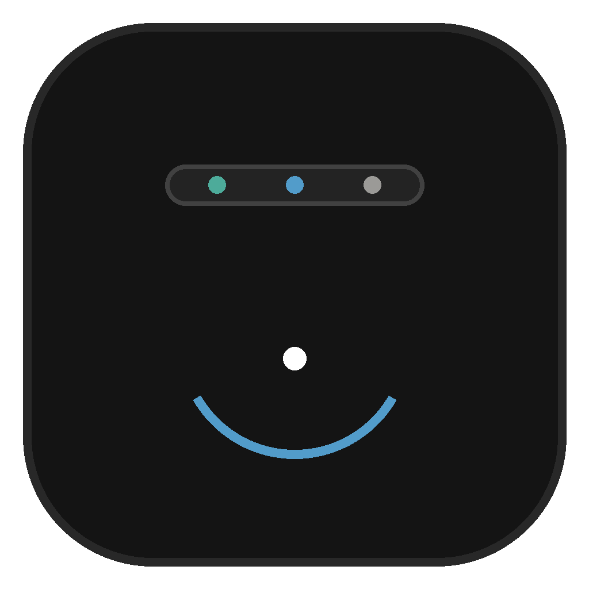
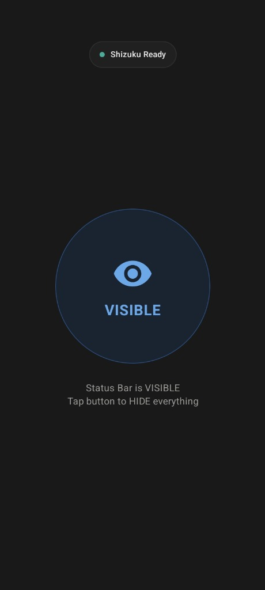
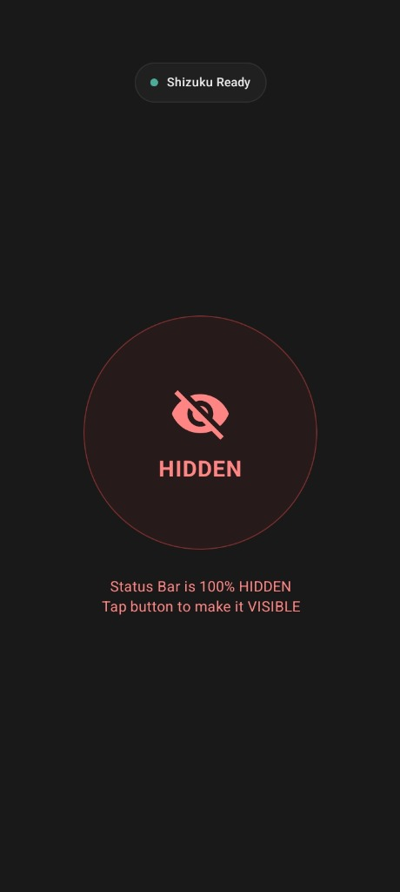

<div align="center">



# CleanBar

**1-Tap Status Bar Hider for Android • Powered by Shizuku**

*Transform your screen into a 100% bezel-less, distraction-free canvas with a single tap.*

[](https://github.com/sachinmandawi/CleanBar/releases)
[](https://www.android.com/)
[](https://kotlinlang.org/)
[](https://developer.android.com/jetpack/compose)
[](https://shizuku.rikka.app/)
[](LICENSE)

[**Download APK**](https://github.com/sachinmandawi/CleanBar/releases/latest) • [**Features**](#-features) • [**Screenshots**](#-screenshots) • [**Installation**](#-installation--setup) • [**Tech Stack**](#-tech-stack)

</div>

---

## 📱 Screenshots

<div align="center">

| 🟢 Status Bar Visible | 🔴 Status Bar 100% Hidden |
| :---: | :---: |
|  |  |
| *Standard System Status Bar* | *100% Pure Clean Screen (Zero Clock, Battery, or Icons)* |

</div>

---

## ✨ Features

- ⚡ **1-Tap Master Toggle:** Instantly hide or restore all status bar elements with a single click.
- 🚫 **Complete Icon & Clock Removal:** Disables system icons, clock, battery percentage, Wi-Fi, 5G, and notification icons seamlessly without root.
- 🎛️ **Quick Settings Tile:** Add the CleanBar tile to your notification quick settings shade to toggle status bar visibility from anywhere.
- 🖤 **Notion Dark Minimalist UI:** Ultra-clean, distraction-free aesthetic with pure flat colors and zero toast popups.
- 📳 **Haptic Feedback:** Crisp physical vibration feedback on every button tap.
- 🔒 **No Root Required:** Utilizes the privileged [Shizuku](https://shizuku.rikka.app/) Binder service via Wireless Debugging / ADB.
- 🛡️ **Fail-Safe State Sync:** Automatically queries and synchronizes real device status on app launch and resume.

---

## 🚀 Installation & Setup

### 1. Set Up Shizuku (One-Time)
1. Install **[Shizuku](https://play.google.com/store/apps/details?id=moe.shizuku.privileged.api)** from Google Play Store or GitHub.
2. Start Shizuku using **Wireless Debugging** (Android 11+) or via ADB from your PC.

### 2. Install CleanBar
1. Download the latest **[`CleanBar.apk`](https://github.com/sachinmandawi/CleanBar/releases/latest)** from GitHub Releases.
2. Install the APK on your Android device.

### 3. Grant Permission & Toggle
1. Open **CleanBar** and tap the top **"Tap to Authorize Shizuku"** pill.
2. Click **"Allow All The Time"** on the Shizuku permission prompt.
3. Tap the center **VISIBLE / HIDDEN** button to enjoy a 100% clean screen!

---

## ⚙️ How It Works

CleanBar communicates directly with the Android System Server through privileged Shizuku binder calls:

```kotlin
// 1. Hide system clock, battery, and status notification icons
cmd statusbar send-disable-flag system-icons clock notification-icons

// 2. Apply global immersive status bar policy across all apps
settings put global policy_control immersive.status=*

// 3. Restore all status bar elements instantly
cmd statusbar send-disable-flag none
settings put global policy_control null
```

---

## 🛠️ Tech Stack & Architecture

- **Language:** Kotlin 2.0
- **UI Framework:** Jetpack Compose & Material 3
- **Privileged Backend:** Rikka Shizuku API (v13.1.5)
- **Quick Settings:** Android System `TileService`
- **Asynchronous Execution:** Kotlin Coroutines + `Dispatchers.IO`
- **Design System:** Custom Notion Dark Color Palette

---

## 📄 License

This project is licensed under the MIT License - see the [LICENSE](LICENSE) file for details.

---

<div align="center">
Developed with ❤️ by <b>Sachin Mandavi</b>
</div>
